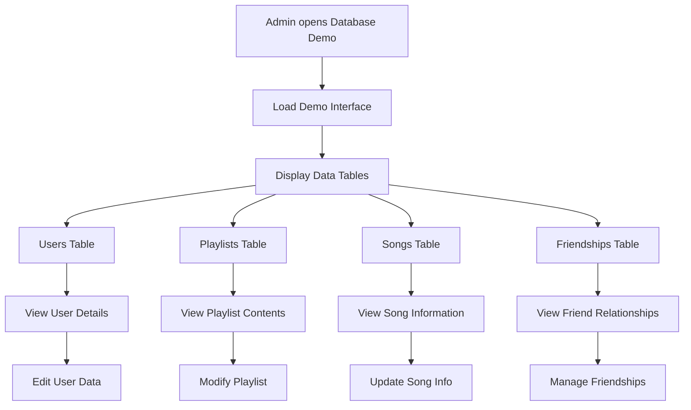
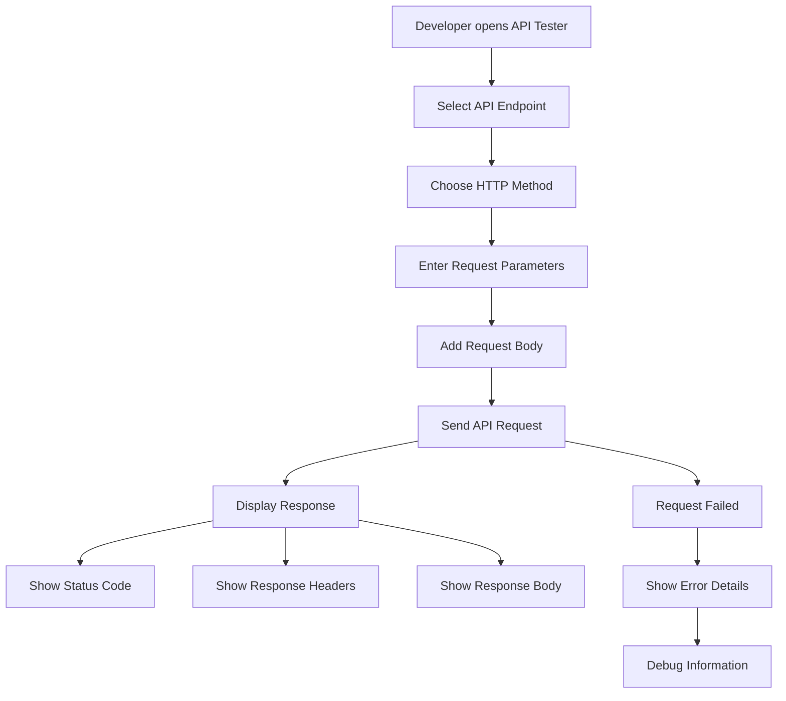

# Database Demo & Admin Features Workflow

**Feature**: Administrative Database Interface and API Testing
**Status**: Phase 6 - Workflow Documentation
**Date**: November 13, 2025

---

## Overview

Administrative interface for database management, API testing, and data visualization. Provides developers and administrators with tools to manage users, playlists, songs, and relationships.

---

## User Flow

### Database Demo Interface



### API Testing Interface



---

## Technical Implementation

### Database Demo Components

**Main Demo Interface**
```javascript
// File: frontend/src/features/database-demo/index.js
class DatabaseDemo {
    constructor() {
        this.currentTable = 'users';
        this.data = {};
        this.init();
    }
    
    async init() {
        console.log('📊 Database Demo: Initializing...');
        this.setupNavigation();
        await this.loadAllData();
        this.displayCurrentTable();
    }
    
    async loadAllData() {
        try {
            // Load all database tables
            const endpoints = ['users', 'playlists', 'songs', 'friendships', 'friend-requests'];
            
            for (const endpoint of endpoints) {
                console.log(`📊 Loading ${endpoint}...`);
                const response = await fetch(`/api/${endpoint}`);
                if (response.ok) {
                    const data = await response.json();
                    this.data[endpoint] = data;
                } else {
                    console.error(`Failed to load ${endpoint}:`, response.statusText);
                    this.data[endpoint] = { error: 'Failed to load' };
                }
            }
        } catch (error) {
            console.error('📊 Database Demo: Error loading data:', error);
        }
    }
}
```

**Data Table Rendering**
```javascript
displayTable(tableName, data) {
    const container = document.getElementById('data-table-container');
    if (!container) return;
    
    if (!data || data.error) {
        container.innerHTML = `
            <div class="error-message">
                <h3>Error Loading ${tableName}</h3>
                <p>${data?.error || 'Unknown error occurred'}</p>
            </div>
        `;
        return;
    }
    
    const items = data[tableName] || data.users || data.playlists || [];
    
    if (items.length === 0) {
        container.innerHTML = `
            <div class="empty-state">
                <h3>No ${tableName} Found</h3>
                <p>The ${tableName} table is currently empty.</p>
            </div>
        `;
        return;
    }
    
    // Generate table HTML
    const headers = Object.keys(items[0]);
    const tableHTML = `
        <div class="data-table">
            <table>
                <thead>
                    <tr>
                        ${headers.map(header => `<th>${header}</th>`).join('')}
                        <th>Actions</th>
                    </tr>
                </thead>
                <tbody>
                    ${items.map(item => `
                        <tr>
                            ${headers.map(header => `
                                <td>${this.formatCellValue(item[header])}</td>
                            `).join('')}
                            <td>
                                <button onclick="databaseDemo.viewDetails('${tableName}', '${item.id}')">
                                    View
                                </button>
                                <button onclick="databaseDemo.editItem('${tableName}', '${item.id}')">
                                    Edit
                                </button>
                            </td>
                        </tr>
                    `).join('')}
                </tbody>
            </table>
        </div>
    `;
    
    container.innerHTML = tableHTML;
}

formatCellValue(value) {
    if (value === null || value === undefined) {
        return '<em>null</em>';
    }
    
    if (Array.isArray(value)) {
        return value.length > 0 ? value.join(', ') : '<em>empty array</em>';
    }
    
    if (typeof value === 'object') {
        return JSON.stringify(value);
    }
    
    if (typeof value === 'string' && value.length > 50) {
        return value.substring(0, 50) + '...';
    }
    
    return value.toString();
}
```

### API Testing Interface

**API Tester Component**
```javascript
// File: frontend/src/features/api-tester/index.js
class APITester {
    constructor() {
        this.endpoints = [
            { name: 'Users', path: '/api/users', methods: ['GET', 'POST', 'PATCH'] },
            { name: 'Playlists', path: '/api/playlists', methods: ['GET', 'POST'] },
            { name: 'Songs', path: '/api/songs', methods: ['GET', 'POST'] },
            { name: 'Friends', path: '/api/friends', methods: ['GET', 'POST'] },
            { name: 'Search Users', path: '/api/search-users', methods: ['GET'] },
            { name: 'Friend Requests', path: '/api/friend-requests', methods: ['GET', 'POST', 'PATCH'] }
        ];
        this.init();
    }
    
    async sendRequest() {
        const endpoint = document.getElementById('api-endpoint').value;
        const method = document.getElementById('api-method').value;
        const params = document.getElementById('api-params').value;
        const body = document.getElementById('api-body').value;
        
        try {
            // Build URL with query parameters
            let url = endpoint;
            if (params && method === 'GET') {
                url += '?' + params;
            }
            
            // Prepare request options
            const options = {
                method,
                headers: {
                    'Content-Type': 'application/json',
                }
            };
            
            // Add body for POST/PATCH requests
            if (body && (method === 'POST' || method === 'PATCH')) {
                options.body = body;
            }
            
            console.log('🔧 API Tester: Sending request:', { url, options });
            
            // Send request
            const startTime = Date.now();
            const response = await fetch(url, options);
            const endTime = Date.now();
            
            // Get response data
            const responseText = await response.text();
            let responseData;
            try {
                responseData = JSON.parse(responseText);
            } catch {
                responseData = responseText;
            }
            
            // Display results
            this.displayResults({
                status: response.status,
                statusText: response.statusText,
                headers: Object.fromEntries(response.headers.entries()),
                data: responseData,
                responseTime: endTime - startTime
            });
            
        } catch (error) {
            console.error('🔧 API Tester: Request failed:', error);
            this.displayResults({
                error: error.message,
                status: 'Network Error',
                data: null
            });
        }
    }
    
    displayResults(result) {
        const container = document.getElementById('api-results');
        if (!container) return;
        
        const statusClass = result.status >= 200 && result.status < 300 ? 'success' : 'error';
        
        container.innerHTML = `
            <div class="api-result ${statusClass}">
                <div class="result-header">
                    <h3>Response</h3>
                    <div class="status-info">
                        <span class="status-code">${result.status}</span>
                        <span class="status-text">${result.statusText || result.error || 'Unknown'}</span>
                        ${result.responseTime ? `<span class="response-time">${result.responseTime}ms</span>` : ''}
                    </div>
                </div>
                
                ${result.headers ? `
                    <div class="result-section">
                        <h4>Headers</h4>
                        <pre>${JSON.stringify(result.headers, null, 2)}</pre>
                    </div>
                ` : ''}
                
                <div class="result-section">
                    <h4>Response Body</h4>
                    <pre>${JSON.stringify(result.data, null, 2)}</pre>
                </div>
            </div>
        `;
    }
}
```

### Backend Admin Endpoints

**Enhanced Data Retrieval**
```javascript
// File: backend/api/admin/data.js
export default async function handler(req, res) {
    // Add CORS headers
    res.setHeader('Access-Control-Allow-Origin', '*');
    res.setHeader('Access-Control-Allow-Methods', 'GET, OPTIONS');
    res.setHeader('Content-Type', 'application/json');
    
    if (req.method === 'OPTIONS') {
        return res.status(200).end();
    }
    
    if (req.method === 'GET') {
        const { table, limit = 100 } = req.query;
        
        try {
            let data;
            
            switch (table) {
                case 'users':
                    data = await prisma.user.findMany({
                        take: parseInt(limit),
                        orderBy: { createdAt: 'desc' }
                    });
                    break;
                    
                case 'playlists':
                    data = await prisma.playlist.findMany({
                        take: parseInt(limit),
                        include: {
                            playlistSongs: {
                                include: { song: true }
                            }
                        },
                        orderBy: { createdAt: 'desc' }
                    });
                    break;
                    
                case 'songs':
                    data = await prisma.song.findMany({
                        take: parseInt(limit),
                        orderBy: { createdAt: 'desc' }
                    });
                    break;
                    
                case 'friendships':
                    data = await prisma.friendship.findMany({
                        take: parseInt(limit),
                        include: {
                            user: { select: { id: true, username: true, displayName: true } },
                            friend: { select: { id: true, username: true, displayName: true } }
                        },
                        orderBy: { createdAt: 'desc' }
                    });
                    break;
                    
                default:
                    return res.status(400).json({ error: 'Invalid table specified' });
            }
            
            return res.status(200).json({ [table]: data });
        } catch (error) {
            console.error('Admin data error:', error);
            return res.status(500).json({
                error: 'Failed to fetch data',
                details: error.message
            });
        }
    }
    
    return res.status(405).json({ error: 'Method not allowed' });
}
```

### Data Management Features

**Bulk Operations**
```javascript
// File: frontend/src/features/database-demo/bulk-operations.js
class BulkOperations {
    async populateTestData() {
        try {
            console.log('📊 Populating test data...');

            // Create test users
            const testUsers = [
                {
                    email: 'test1@example.com',
                    username: 'testuser1',
                    displayName: 'Test User 1',
                    healthGoals: ['stress_relief', 'sleep_improvement'],
                    musicPreferences: ['classical', 'ambient']
                },
                {
                    email: 'test2@example.com',
                    username: 'testuser2',
                    displayName: 'Test User 2',
                    healthGoals: ['anxiety_relief', 'focus_enhancement'],
                    musicPreferences: ['nature_sounds', 'instrumental']
                }
            ];

            for (const userData of testUsers) {
                const response = await fetch('/api/users', {
                    method: 'POST',
                    headers: { 'Content-Type': 'application/json' },
                    body: JSON.stringify(userData)
                });

                if (response.ok) {
                    console.log('✅ Created test user:', userData.username);
                } else {
                    console.error('❌ Failed to create user:', userData.username);
                }
            }

            this.showSuccess('Test data populated successfully!');
            await this.refreshData();
        } catch (error) {
            console.error('Bulk operation error:', error);
            this.showError('Failed to populate test data');
        }
    }

    async clearAllData() {
        if (!confirm('Are you sure you want to clear ALL data? This cannot be undone!')) {
            return;
        }

        try {
            console.log('📊 Clearing all data...');

            // Clear in order to respect foreign key constraints
            const clearOrder = ['playlist_songs', 'friendships', 'friend_requests', 'songs', 'playlists', 'users'];

            for (const table of clearOrder) {
                const response = await fetch(`/api/admin/clear`, {
                    method: 'DELETE',
                    headers: { 'Content-Type': 'application/json' },
                    body: JSON.stringify({ table })
                });

                if (response.ok) {
                    console.log(`✅ Cleared table: ${table}`);
                } else {
                    console.error(`❌ Failed to clear table: ${table}`);
                }
            }

            this.showSuccess('All data cleared successfully!');
            await this.refreshData();
        } catch (error) {
            console.error('Clear data error:', error);
            this.showError('Failed to clear data');
        }
    }
}
```

### Database Statistics

**Analytics Dashboard**
```javascript
async loadStatistics() {
    try {
        const response = await fetch('/api/admin/stats');
        if (!response.ok) {
            throw new Error('Failed to load statistics');
        }

        const stats = await response.json();
        this.displayStatistics(stats);
    } catch (error) {
        console.error('Statistics error:', error);
    }
}

displayStatistics(stats) {
    const container = document.getElementById('stats-container');
    if (!container) return;

    container.innerHTML = `
        <div class="stats-grid">
            <div class="stat-card">
                <h3>Total Users</h3>
                <div class="stat-number">${stats.totalUsers || 0}</div>
            </div>
            <div class="stat-card">
                <h3>Total Playlists</h3>
                <div class="stat-number">${stats.totalPlaylists || 0}</div>
            </div>
            <div class="stat-card">
                <h3>Total Songs</h3>
                <div class="stat-number">${stats.totalSongs || 0}</div>
            </div>
            <div class="stat-card">
                <h3>Active Friendships</h3>
                <div class="stat-number">${stats.totalFriendships || 0}</div>
            </div>
            <div class="stat-card">
                <h3>Pending Requests</h3>
                <div class="stat-number">${stats.pendingRequests || 0}</div>
            </div>
            <div class="stat-card">
                <h3>Database Size</h3>
                <div class="stat-number">${stats.databaseSize || 'Unknown'}</div>
            </div>
        </div>
    `;
}
```

---

## Key Features

### Real-time Data Management
- Live database table viewing
- CRUD operations on all models
- Bulk data operations
- Data export/import capabilities

### API Testing Tools
- Interactive endpoint testing
- Request/response inspection
- Performance monitoring
- Error debugging assistance

### Administrative Controls
- User management and moderation
- Playlist curation and verification
- System health monitoring
- Database maintenance tools

### Security Considerations
- Admin authentication required
- Rate limiting on bulk operations
- Audit logging for all changes
- Data sanitization and validation

---

## Error Handling

### Database Connection Errors
```javascript
catch (error) {
    console.error('Database connection error:', error);
    this.showError('Unable to connect to database. Please check your connection.');
}
```

### API Request Failures
```javascript
if (!response.ok) {
    const errorData = await response.json();
    throw new Error(errorData.error || 'API request failed');
}
```

### Data Validation Errors
```javascript
if (!data || typeof data !== 'object') {
    throw new Error('Invalid data format received from server');
}
```
```
