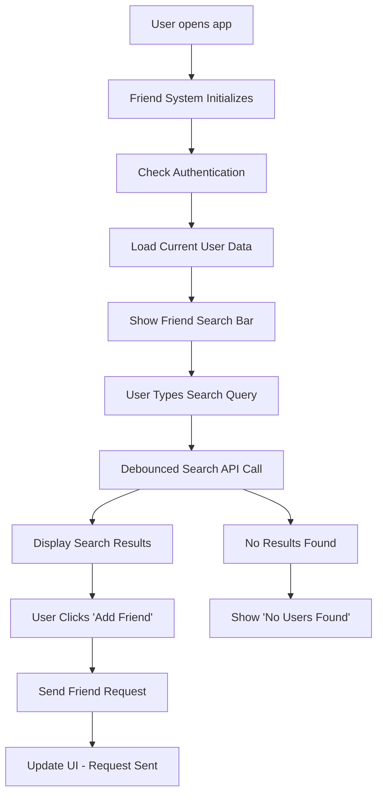
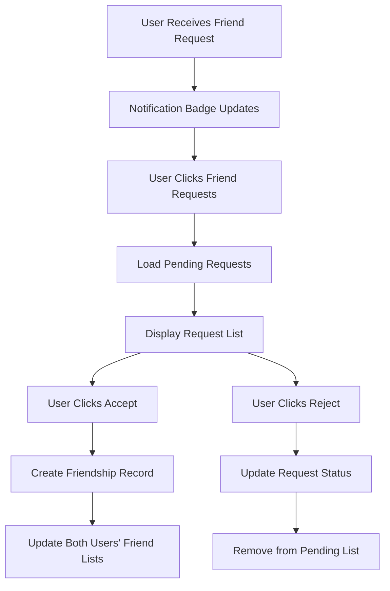
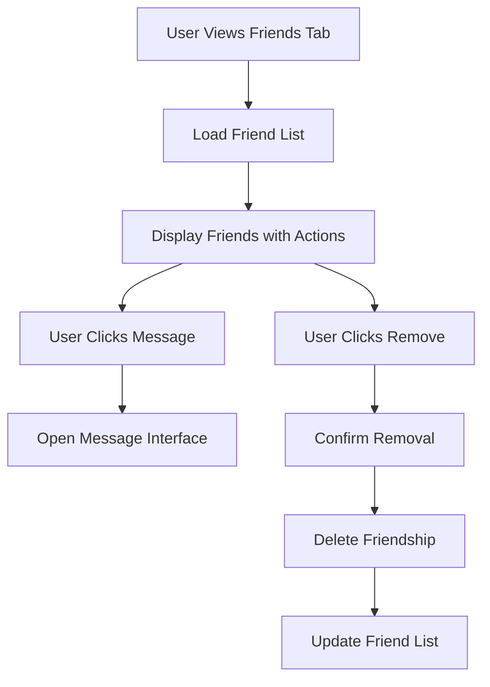

# Friend System Workflow

**Feature**: Social Features - Friend Search, Requests, and Management
**Status**: Phase 6 - Workflow Documentation
**Date**: November 13, 2025

---

## Overview

Complete social system allowing users to search for friends, send/receive friend requests, and manage their friend network for shared music therapy experiences.

---

## User Flow

### Friend Search and Request



### Friend Request Management



### Friend List Management



---

## Technical Implementation

### Frontend Components

**Main Component**:
- `src/friends.js` - Primary friend system implementation
- `frontend/src/features/friends/index.js` - Alternative implementation

**Class Structure**:
```javascript
// File: src/friends.js
class FriendSystem {
    constructor() {
        this.currentUser = null;
        this.searchTimeout = null;
        this.currentSelectedUser = null;
        this.init();
    }
}
```

### Initialization Process

**Auth-Dependent Initialization**
```javascript
async init() {
    console.log('🔍 FriendSystem: Initializing...');
    
    // Wait for auth state to be ready
    auth.onAuthStateChanged(async (user) => {
        console.log('🔍 FriendSystem: Auth state changed', user ? 'User logged in' : 'User logged out');
        if (user) {
            console.log('🔍 FriendSystem: Firebase user:', user.uid);
            this.currentUser = await this.getCurrentUserData(user.uid);
            console.log('🔍 FriendSystem: Current user data:', this.currentUser);
            this.setupEventListeners();
            this.showFriendSearchBar();
            this.loadFriendRequestsCount();
            this.loadFriendsCount();
        } else {
            this.hideFriendSearchBar();
        }
    });
}
```

**User Data Retrieval**
```javascript
async getCurrentUserData(firebaseUid) {
    try {
        console.log('🔍 FriendSystem: Fetching user data for UID:', firebaseUid);
        let response = await fetch(`/api/users?firebaseUid=${firebaseUid}`);
        
        if (!response.ok) {
            // Fallback: search by email
            const auth = window.auth;
            if (auth && auth.currentUser && auth.currentUser.email) {
                console.log('🔍 FriendSystem: Trying fallback search by email:', auth.currentUser.email);
                response = await fetch(`/api/users?email=${encodeURIComponent(auth.currentUser.email)}`);
                if (response.ok) {
                    const data = await response.json();
                    const userData = data.user || data;
                    return userData;
                }
            }
        }
        
        const data = await response.json();
        return data.user || data;
    } catch (error) {
        console.error('🔍 FriendSystem: Error fetching user data:', error);
        return null;
    }
}
```

### Search Functionality

**Debounced Search**
```javascript
async handleSearch(query) {
    console.log('🔍 FriendSystem: handleSearch called with query:', query);
    
    // Clear previous timeout
    if (this.searchTimeout) {
        clearTimeout(this.searchTimeout);
    }
    
    // If query is empty, hide results
    if (!query.trim()) {
        console.log('🔍 FriendSystem: Empty query, hiding results');
        this.hideSearchResults();
        return;
    }
    
    // Debounce search
    this.searchTimeout = setTimeout(async () => {
        console.log('🔍 FriendSystem: Executing search for:', query.trim());
        await this.performSearch(query.trim());
    }, 300);
}

async performSearch(query) {
    if (!this.currentUser) return;
    
    try {
        const response = await fetch(`/api/search-users?query=${encodeURIComponent(query)}&currentUserId=${this.currentUser.id}&limit=10`);
        
        if (response.ok) {
            const data = await response.json();
            this.displaySearchResults(data.users);
        } else {
            console.error('Search failed:', response.statusText);
            this.hideSearchResults();
        }
    } catch (error) {
        console.error('Search error:', error);
        this.hideSearchResults();
    }
}
```

### Friend Request Management

**Sending Friend Requests**
```javascript
async sendFriendRequest(userId) {
    if (!this.currentUser) return;
    
    try {
        const response = await fetch('/api/friends', {
            method: 'POST',
            headers: {
                'Content-Type': 'application/json',
            },
            body: JSON.stringify({
                action: 'send_request',
                senderId: this.currentUser.id,
                receiverId: userId
            })
        });
        
        if (response.ok) {
            const data = await response.json();
            console.log('Friend request sent:', data);
            this.showSuccess('Friend request sent!');
            this.hideSearchResults();
        } else {
            const error = await response.json();
            this.showError(error.error || 'Failed to send friend request');
        }
    } catch (error) {
        console.error('Error sending friend request:', error);
        this.showError('Failed to send friend request');
    }
}
```

### Dynamic UI Rendering

**Friend List Display**
```javascript
displayFriends(friends) {
    const container = document.getElementById('friends-list');
    if (!container) return;
    
    if (friends.length === 0) {
        container.innerHTML = '<p class="no-friends">No friends yet. Search for people to add!</p>';
        return;
    }
    
    container.innerHTML = friends.map(friendship => {
        const friend = friendship.friend;
        return `
            <div class="friend-item">
                <div class="friend-avatar">
                    ${friend.displayName ? friend.displayName.charAt(0).toUpperCase() : friend.username ? friend.username.charAt(0).toUpperCase() : '?'}
                </div>
                <div class="friend-info">
                    <div class="friend-name">${friend.displayName || friend.username || 'Unknown'}</div>
                    <div class="friend-username">@${friend.username || 'unknown'}</div>
                    <div class="friend-status">Friends since ${new Date(friendship.createdAt).toLocaleDateString()}</div>
                </div>
                <div class="friend-actions">
                    <button class="friend-action-btn message" onclick="friendSystem.messageFriend('${friend.id}')">
                        💬 Message
                    </button>
                    <button class="friend-action-btn remove" onclick="friendSystem.removeFriend('${friend.id}')">
                        ❌ Remove
                    </button>
                </div>
            </div>
        `;
    }).join('');
}
```

### Backend API Endpoints

**User Search Endpoint**
```javascript
// File: backend/api/search-users.js
export default async function handler(req, res) {
    if (req.method === 'GET') {
        const { query, currentUserId, limit = 10 } = req.query;
        
        try {
            const users = await prisma.user.findMany({
                where: {
                    AND: [
                        { id: { not: currentUserId } },
                        {
                            OR: [
                                { username: { contains: query, mode: 'insensitive' } },
                                { displayName: { contains: query, mode: 'insensitive' } },
                                { email: { contains: query, mode: 'insensitive' } }
                            ]
                        }
                    ]
                },
                select: {
                    id: true,
                    username: true,
                    displayName: true,
                    email: true
                },
                take: parseInt(limit)
            });
            
            return res.status(200).json({ users });
        } catch (error) {
            console.error('Search users error:', error);
            return res.status(500).json({ error: 'Search failed' });
        }
    }
}
```

**Friend Management Endpoint**
```javascript
// File: backend/api/friends.js
export default async function handler(req, res) {
    if (req.method === 'POST') {
        const { action, senderId, receiverId } = req.body;
        
        if (action === 'send_request') {
            // Check if friendship already exists
            const existingFriendship = await prisma.friendship.findFirst({
                where: {
                    OR: [
                        { userId: senderId, friendId: receiverId },
                        { userId: receiverId, friendId: senderId }
                    ]
                }
            });
            
            if (existingFriendship) {
                return res.status(400).json({ error: 'Users are already friends' });
            }
            
            // Create friend request
            const friendRequest = await prisma.friendRequest.create({
                data: {
                    senderId,
                    receiverId,
                    status: 'PENDING'
                },
                include: {
                    sender: { select: { id: true, username: true, displayName: true, email: true } },
                    receiver: { select: { id: true, username: true, displayName: true, email: true } }
                }
            });
            
            return res.status(201).json({ friendRequest });
        }
    }
}
```

### Database Schema

**Friend-Related Models**
```prisma
// File: prisma/schema.prisma
model Friendship {
  id        String   @id @default(uuid())
  userId    String   @map("user_id")
  friendId  String   @map("friend_id")
  createdAt DateTime @default(now()) @map("created_at")

  user   User @relation("UserFriendships", fields: [userId], references: [id], onDelete: Cascade)
  friend User @relation("FriendFriendships", fields: [friendId], references: [id], onDelete: Cascade)

  @@unique([userId, friendId])
  @@map("friendships")
}

model FriendRequest {
  id         String              @id @default(uuid())
  senderId   String              @map("sender_id")
  receiverId String              @map("receiver_id")
  status     FriendRequestStatus @default(PENDING)
  createdAt  DateTime            @default(now()) @map("created_at")
  updatedAt  DateTime            @updatedAt @map("updated_at")

  sender   User @relation("SentFriendRequests", fields: [senderId], references: [id], onDelete: Cascade)
  receiver User @relation("ReceivedFriendRequests", fields: [receiverId], references: [id], onDelete: Cascade)

  @@unique([senderId, receiverId])
  @@map("friend_requests")
}

enum FriendRequestStatus {
  PENDING
  ACCEPTED
  REJECTED
  BLOCKED
}
```

---

## Error Handling

### Search Errors
```javascript
catch (error) {
    console.error('Search error:', error);
    this.hideSearchResults();
    this.showError('Search failed. Please try again.');
}
```

### Friend Request Errors
```javascript
if (!response.ok) {
    const error = await response.json();
    this.showError(error.error || 'Failed to send friend request');
    return;
}
```

### Authentication Errors
```javascript
if (!this.currentUser) {
    console.error('🔍 FriendSystem: No current user, cannot perform action');
    this.showError('Please log in to use friend features');
    return;
}
```

---

## Key Features

### Real-time Updates
- Friend request counts update automatically
- Search results appear as user types (debounced)
- UI updates immediately after actions

### Security Features
- Users cannot add themselves as friends
- Duplicate friend requests prevented
- Authentication required for all actions

### User Experience
- Debounced search (300ms delay)
- Loading states during API calls
- Success/error feedback messages
- Responsive friend list display
```
