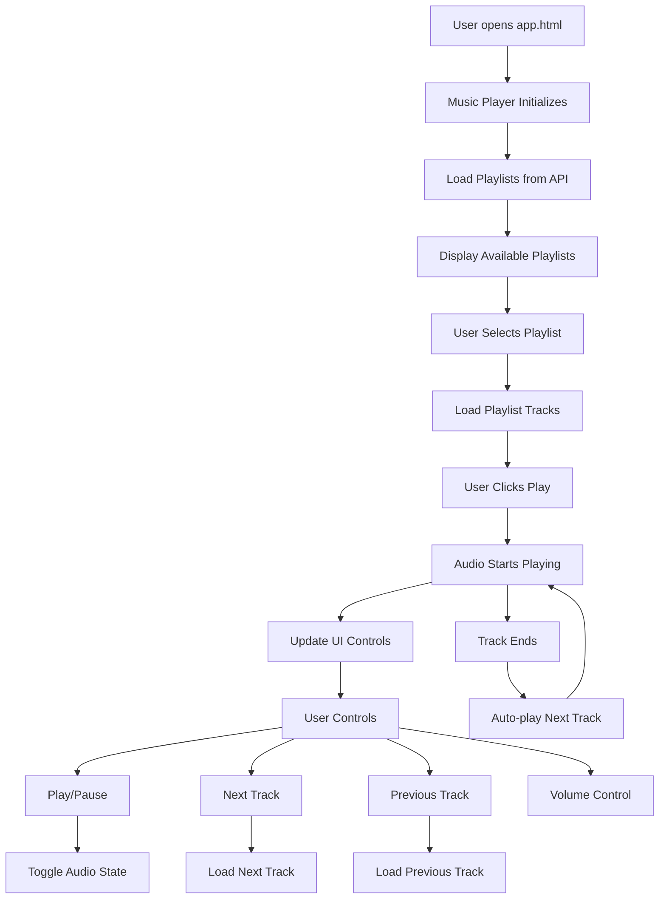
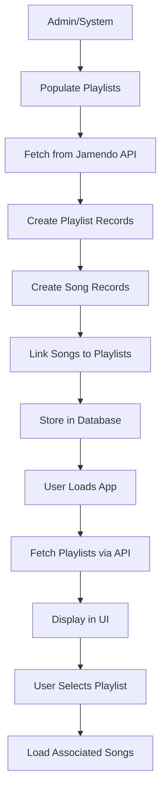

# Music Player & Playlist Management Workflow

**Feature**: Therapeutic Music Player with Playlist Management
**Status**: Phase 6 - Workflow Documentation
**Date**: November 13, 2025

---

## Overview

Full-featured audio player with therapeutic playlists designed for health and wellness goals (anxiety relief, focus, sleep, etc.).

---

## User Flow

### Music Player Interaction



### Playlist Management



---

## Technical Implementation

### Frontend Components

**Main Component**:
- `src/music-player.js` - Primary music player implementation
- `frontend/src/features/music/player.js` - Alternative implementation

**Class Structure**:
```javascript
// File: src/music-player.js
class MusicPlayer {
    constructor() {
        this.audio = new Audio();
        this.currentPlaylist = null;
        this.currentTrack = null;
        this.currentTrackIndex = 0;
        this.isPlaying = false;
        this.playlists = [];
        
        this.init();
    }
}
```

### Initialization Process

**Step 1: Audio Setup**
```javascript
init() {
    console.log('🎵 Music Player: Initializing...');
    
    // Set up audio element event listeners
    this.audio.addEventListener('ended', () => this.playNext());
    this.audio.addEventListener('timeupdate', () => this.updateProgress());
    this.audio.addEventListener('loadedmetadata', () => this.onTrackLoaded());
    this.audio.addEventListener('error', (e) => this.handleError(e));
    
    // Load playlists from API
    this.loadPlaylists();
}
```

**Step 2: Playlist Loading**
```javascript
async loadPlaylists() {
    try {
        console.log('🎵 Music Player: Fetching playlists from API...');
        const response = await fetch('/api/playlists');
        
        if (!response.ok) {
            throw new Error(`HTTP error! status: ${response.status}`);
        }
        
        const data = await response.json();
        this.playlists = data.playlists || [];
        
        if (this.playlists.length === 0) {
            this.displayEmptyPlaylists();
        } else {
            this.displayPlaylists();
            this.selectPlaylist(this.playlists[0]); // Auto-select first
        }
    } catch (error) {
        console.error('🎵 Music Player: Failed to load playlists:', error);
        this.showError('Failed to load playlists. Please refresh the page.');
    }
}
```

### Playback Control

**Play/Pause Toggle**
```javascript
togglePlayPause() {
    if (this.isPlaying) {
        this.pause();
    } else {
        this.play();
    }
}

play() {
    this.audio.play()
        .then(() => {
            this.isPlaying = true;
            this.updatePlayPauseButton();
        })
        .catch(error => {
            console.error('Error playing audio:', error);
            this.showError('Failed to play audio. The audio file may be unavailable.');
        });
}

pause() {
    this.audio.pause();
    this.isPlaying = false;
    this.updatePlayPauseButton();
}
```

**Track Navigation**
```javascript
playNext() {
    if (!this.currentPlaylist) return;
    
    this.currentTrackIndex = (this.currentTrackIndex + 1) % this.currentPlaylist.tracks.length;
    this.playTrack(this.currentTrackIndex);
}

playTrack(index) {
    if (!this.currentPlaylist || !this.currentPlaylist.tracks[index]) {
        console.error('Invalid track index:', index);
        return;
    }
    
    this.currentTrackIndex = index;
    this.currentTrack = this.currentPlaylist.tracks[index];
    
    console.log('🎵 Playing track:', this.currentTrack.title);
    
    this.audio.src = this.currentTrack.audioUrl;
    this.audio.load();
    this.play();
    
    this.updatePlayerUI();
}
```

### UI Updates

**Dynamic Button States**
```javascript
updatePlayPauseButton() {
    const playPauseBtn = document.querySelector('.play-pause');
    if (!playPauseBtn) return;
    
    if (this.isPlaying) {
        playPauseBtn.innerHTML = `
            <svg width="20" height="20" viewBox="0 0 24 24" fill="currentColor">
                <path d="M6 19h4V5H6v14zm8-14v14h4V5h-4z"/>
            </svg>
        `;
    } else {
        playPauseBtn.innerHTML = `
            <svg width="20" height="20" viewBox="0 0 24 24" fill="currentColor">
                <path d="M8 5v14l11-7z"/>
            </svg>
        `;
    }
}
```

### Backend API Endpoints

**Playlist Retrieval**
```javascript
// File: backend/api/playlists.js
export default async function handler(req, res) {
    if (req.method === 'GET') {
        try {
            const playlists = await prisma.playlist.findMany({
                include: {
                    playlistSongs: {
                        include: {
                            song: true
                        }
                    }
                }
            });
            
            return res.status(200).json({ playlists });
        } catch (error) {
            console.error('Playlists API Error:', error);
            return res.status(500).json({
                error: 'Internal server error',
                details: process.env.NODE_ENV === 'development' ? error.message : undefined
            });
        }
    }
}
```

### Database Schema

**Playlist Models**
```prisma
// File: prisma/schema.prisma
model Playlist {
  id          String   @id @default(uuid())
  title       String
  description String?  @db.Text
  mood        String   // e.g., "anxiety", "focus", "sleep"
  createdBy   String?  @map("created_by")
  verified    Boolean  @default(false)
  coverImage  String?  @map("cover_image")
  createdAt   DateTime @default(now()) @map("created_at")
  updatedAt   DateTime @updatedAt @map("updated_at")

  creator      User?          @relation(fields: [createdBy], references: [id])
  playlistSongs PlaylistSong[]

  @@map("playlists")
}

model Song {
  id          String   @id @default(uuid())
  title       String
  artist      String
  duration    Int      // Duration in seconds
  audioUrl    String   @map("audio_url")
  albumArt    String?  @map("album_art")
  jamendoId   String?  @unique @map("jamendo_id")
  createdAt   DateTime @default(now()) @map("created_at")

  playlistSongs PlaylistSong[]

  @@map("songs")
}

model PlaylistSong {
  id         String   @id @default(uuid())
  playlistId String   @map("playlist_id")
  songId     String   @map("song_id")
  order      Int      @default(0)
  createdAt  DateTime @default(now()) @map("created_at")

  playlist Playlist @relation(fields: [playlistId], references: [id], onDelete: Cascade)
  song     Song     @relation(fields: [songId], references: [id], onDelete: Cascade)

  @@unique([playlistId, songId])
  @@map("playlist_songs")
}
```
