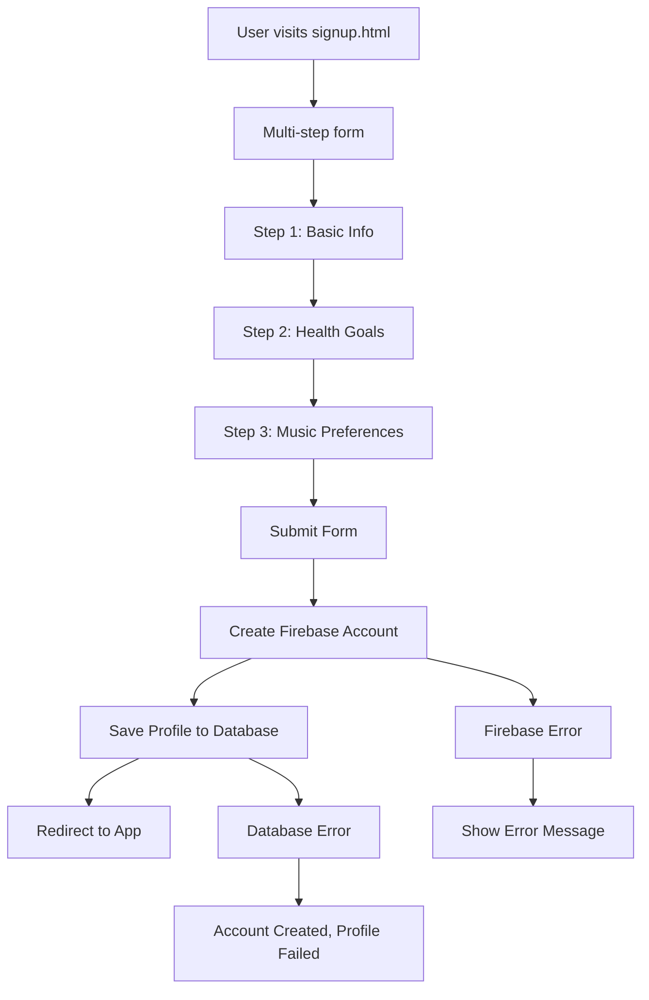
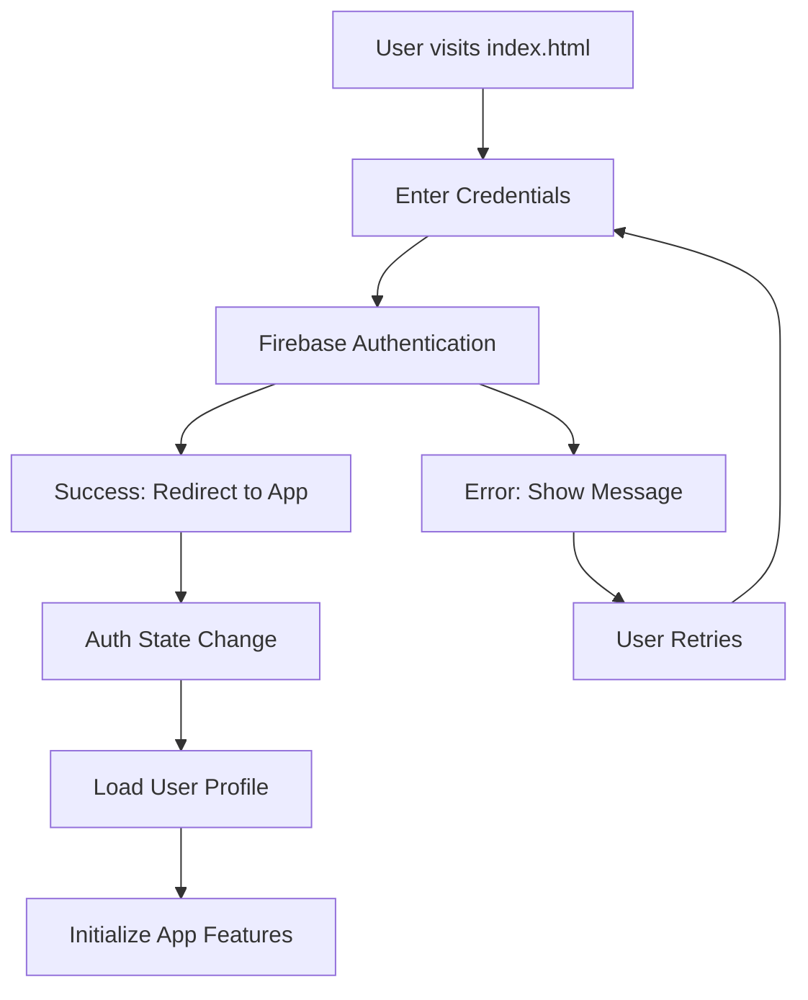

# User Authentication Workflow

**Feature**: User Registration and Login System
**Status**: Phase 6 - Workflow Documentation
**Date**: November 13, 2025

---

## Overview

Complete authentication system using Firebase Authentication with PostgreSQL user profiles for health and wellness data.

---

## User Flow

### Registration Flow



### Login Flow



---

## Technical Implementation

### Frontend Components

**Entry Points**:
- `frontend/index.html` - Login page
- `frontend/pages/signup.html` - Registration page

**JavaScript Modules**:
- `frontend/src/auth/index.js` - Main authentication logic
- `frontend/src/auth/signup.js` - Enhanced signup with health data
- `src/pages/signup.js` - Legacy signup implementation

### Registration Process

**Step 1: Form Collection**
```javascript
// File: frontend/src/auth/signup.js
const formData = {
    email: document.getElementById('email').value,
    password: document.getElementById('password').value,
    username: document.getElementById('username').value,
    healthGoals: Array.from(document.querySelectorAll('input[name="health-goals"]:checked')).map(cb => cb.value),
    musicPreferences: Array.from(document.querySelectorAll('input[name="music-preferences"]:checked')).map(cb => cb.value),
    dailyListeningGoal: parseInt(document.getElementById('listening-goal').value) || null
};
```

**Step 2: Firebase Account Creation**
```javascript
// Create user in Firebase
const userCredential = await createUserWithEmailAndPassword(auth, email, password);
console.log('User created:', userCredential.user);
```

**Step 3: Database Profile Creation**
```javascript
// Save to Prisma database
const response = await fetch('/api/users', {
    method: 'POST',
    headers: { 'Content-Type': 'application/json' },
    body: JSON.stringify({
        email: formData.email,
        username: formData.username || null,
        displayName: formData.username || formData.email.split('@')[0],
        dailyListeningGoal: formData.dailyListeningGoal,
        healthGoals: formData.healthGoals,
        musicPreferences: formData.musicPreferences,
        timezone: Intl.DateTimeFormat().resolvedOptions().timeZone
    })
});
```

### Login Process

**Step 1: Credential Validation**
```javascript
// File: frontend/src/auth/index.js
const userCredential = await signInWithEmailAndPassword(auth, email, password);
console.log('User logged in:', userCredential.user);
```

**Step 2: Auth State Management**
```javascript
onAuthStateChanged(auth, (user) => {
    const currentPath = window.location.pathname;
    const isOnAuthPage = currentPath.endsWith('index.html') || 
                        currentPath.endsWith('signup.html') || 
                        currentPath === '/';

    if (user && !isRedirecting && isOnAuthPage) {
        isRedirecting = true;
        console.log('User is logged in, redirecting to app.html');
        window.location.href = 'pages/app.html';
    } else if (!user && currentPath.endsWith('app.html')) {
        window.location.href = '../index.html';
    }
});
```

### Backend API Endpoints

**User Creation Endpoint**
```javascript
// File: backend/api/users/index.js
export default async function handler(req, res) {
  if (req.method === 'POST') {
    const { email, username, displayName, healthGoals, musicPreferences, dailyListeningGoal, timezone } = req.body;
    
    // Create new user with all fields
    const user = await prisma.user.create({
      data: {
        email,
        username: username || null,
        displayName: displayName || null,
        emailVerified: false,
        healthGoals: healthGoals || [],
        musicPreferences: musicPreferences || [],
        dailyListeningGoal: dailyListeningGoal || null,
        timezone: timezone || null
      }
    });

    return res.status(201).json({
      message: 'User created successfully',
      user
    });
  }
}
```

### Database Schema

**User Model**
```prisma
// File: prisma/schema.prisma
model User {
  id            String    @id @default(uuid())
  email         String    @unique
  firebaseUid   String?   @unique
  username      String?   @unique
  displayName   String?
  emailVerified Boolean   @default(false)

  // Health & Wellness preferences
  healthGoals   String[]  @default([])
  musicPreferences String[] @default([])
  dailyListeningGoal Int?

  // Metadata
  timezone      String?
  createdAt     DateTime  @default(now()) @map("created_at")
  updatedAt     DateTime  @updatedAt @map("updated_at")

  @@map("users")
}
```

---

## Error Handling

### Firebase Authentication Errors
```javascript
catch (error) {
    let errorMessage = 'Failed to sign in. Please check your credentials.';
    
    if (error.code === 'auth/user-not-found' || error.code === 'auth/wrong-password') {
        errorMessage = 'Invalid email or password.';
    } else if (error.code === 'auth/too-many-requests') {
        errorMessage = 'Too many failed attempts. Please try again later.';
    }
    
    // Display user-friendly error
    errorElement.textContent = errorMessage;
    errorElement.style.display = 'block';
    setTimeout(() => errorElement.style.display = 'none', 5000);
}
```

### Database Operation Errors
```javascript
catch (dbError) {
    console.error('Database error:', dbError);
    showError('Account created but profile setup failed: ' + dbError.message);
}
```
