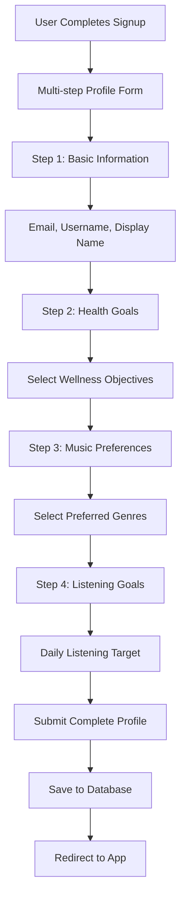
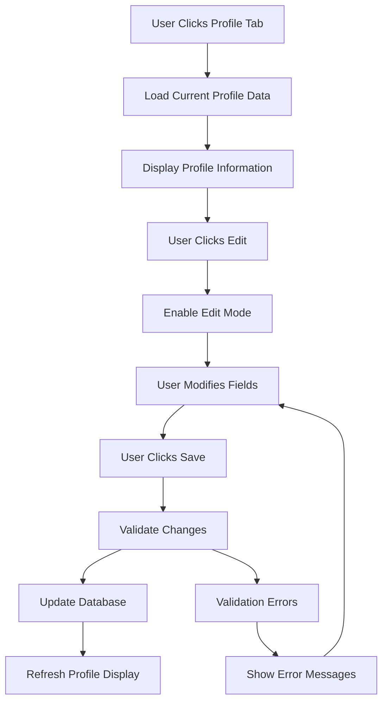

# User Profile Management Workflow

**Feature**: Health & Wellness Profile Management
**Status**: Phase 6 - Workflow Documentation
**Date**: November 13, 2025

---

## Overview

Comprehensive user profile system focused on health goals, music preferences, and wellness tracking for personalized music therapy experiences.

---

## User Flow

### Profile Creation (During Signup)



### Profile Viewing and Editing



---

## Technical Implementation

### Profile Data Structure

**User Model Fields**
```javascript
// Health & Wellness Profile Data
const profileData = {
    // Basic Information
    email: 'user@example.com',
    username: 'musiclover123',
    displayName: 'Music Lover',
    
    // Health & Wellness
    healthGoals: ['mental_wellness', 'stress_relief', 'sleep_improvement'],
    musicPreferences: ['classical', 'ambient', 'nature_sounds'],
    dailyListeningGoal: 30, // minutes
    
    // Metadata
    timezone: 'America/New_York',
    emailVerified: false,
    createdAt: '2025-11-13T...',
    updatedAt: '2025-11-13T...'
};
```

### Profile Creation Process

**Multi-step Form Collection**
```javascript
// File: frontend/src/auth/signup.js
function collectFormData() {
    const formData = {
        // Basic info
        email: document.getElementById('email').value,
        username: document.getElementById('username').value,
        password: document.getElementById('password').value,
        
        // Health goals (checkboxes)
        healthGoals: Array.from(
            document.querySelectorAll('input[name="health-goals"]:checked')
        ).map(cb => cb.value),
        
        // Music preferences (checkboxes)
        musicPreferences: Array.from(
            document.querySelectorAll('input[name="music-preferences"]:checked')
        ).map(cb => cb.value),
        
        // Daily listening goal (number input)
        dailyListeningGoal: parseInt(document.getElementById('listening-goal').value) || null
    };
    
    return formData;
}
```

**Profile Validation**
```javascript
function validateStep(step) {
    switch(step) {
        case 1: // Basic info
            const email = document.getElementById('email').value;
            const password = document.getElementById('password').value;
            
            if (!email || !email.includes('@')) {
                showError('Please enter a valid email address');
                return false;
            }
            
            if (!password || password.length < 6) {
                showError('Password must be at least 6 characters');
                return false;
            }
            break;
            
        case 2: // Health goals
            const healthGoals = document.querySelectorAll('input[name="health-goals"]:checked');
            if (healthGoals.length === 0) {
                showError('Please select at least one health goal');
                return false;
            }
            break;
            
        case 3: // Music preferences
            const musicPrefs = document.querySelectorAll('input[name="music-preferences"]:checked');
            if (musicPrefs.length === 0) {
                showError('Please select at least one music preference');
                return false;
            }
            break;
    }
    
    return true;
}
```

### Profile Database Operations

**Create Profile**
```javascript
// File: backend/api/users/index.js
if (req.method === 'POST') {
    const { 
        email, 
        username, 
        displayName, 
        healthGoals, 
        musicPreferences, 
        dailyListeningGoal, 
        timezone 
    } = req.body;
    
    try {
        // Validate required fields
        if (!email) {
            return res.status(400).json({ error: 'Email is required' });
        }
        
        // Check if user already exists
        const existingUser = await prisma.user.findUnique({
            where: { email }
        });
        
        if (existingUser) {
            return res.status(409).json({ error: 'User already exists' });
        }
        
        // Create new user with all profile fields
        const user = await prisma.user.create({
            data: {
                email,
                username: username || null,
                displayName: displayName || null,
                emailVerified: false,
                healthGoals: healthGoals || [],
                musicPreferences: musicPreferences || [],
                dailyListeningGoal: dailyListeningGoal || null,
                timezone: timezone || null
            }
        });
        
        return res.status(201).json({
            message: 'User created successfully',
            user: {
                id: user.id,
                email: user.email,
                username: user.username,
                displayName: user.displayName,
                healthGoals: user.healthGoals,
                musicPreferences: user.musicPreferences,
                dailyListeningGoal: user.dailyListeningGoal
            }
        });
    } catch (error) {
        console.error('Error creating user:', error);
        return res.status(500).json({
            error: 'Failed to create user',
            details: error.message
        });
    }
}
```

**Update Profile**
```javascript
if (req.method === 'PATCH') {
    const { userId } = req.query;
    const updateData = req.body;
    
    try {
        // Validate user exists
        const existingUser = await prisma.user.findUnique({
            where: { id: userId }
        });
        
        if (!existingUser) {
            return res.status(404).json({ error: 'User not found' });
        }
        
        // Update user profile
        const updatedUser = await prisma.user.update({
            where: { id: userId },
            data: {
                ...updateData,
                updatedAt: new Date()
            }
        });
        
        return res.status(200).json({
            message: 'Profile updated successfully',
            user: updatedUser
        });
    } catch (error) {
        console.error('Error updating profile:', error);
        return res.status(500).json({
            error: 'Failed to update profile',
            details: error.message
        });
    }
}
```

### Profile Retrieval

**Get User Profile**
```javascript
if (req.method === 'GET') {
    const { userId, email, firebaseUid } = req.query;
    
    try {
        let user;
        
        if (userId) {
            user = await prisma.user.findUnique({
                where: { id: userId }
            });
        } else if (email) {
            user = await prisma.user.findUnique({
                where: { email }
            });
        } else if (firebaseUid) {
            user = await prisma.user.findUnique({
                where: { firebaseUid }
            });
        }
        
        if (!user) {
            return res.status(404).json({ error: 'User not found' });
        }
        
        // Return user without sensitive data
        const safeUser = {
            id: user.id,
            email: user.email,
            username: user.username,
            displayName: user.displayName,
            healthGoals: user.healthGoals,
            musicPreferences: user.musicPreferences,
            dailyListeningGoal: user.dailyListeningGoal,
            timezone: user.timezone,
            emailVerified: user.emailVerified,
            createdAt: user.createdAt,
            updatedAt: user.updatedAt
        };
        
        return res.status(200).json({ user: safeUser });
    } catch (error) {
        console.error('Error fetching user:', error);
        return res.status(500).json({
            error: 'Failed to fetch user',
            details: error.message
        });
    }
}
```

### Frontend Profile Management

**Profile Display Component**
```javascript
// File: frontend/src/features/profile/index.js
class ProfileManager {
    constructor() {
        this.currentUser = null;
        this.isEditing = false;
        this.init();
    }

    async loadUserProfile(userId) {
        try {
            const response = await fetch(`/api/users?userId=${userId}`);
            if (!response.ok) {
                throw new Error('Failed to load profile');
            }

            const data = await response.json();
            this.currentUser = data.user;
            this.displayProfile();
        } catch (error) {
            console.error('Profile load error:', error);
            this.showError('Failed to load profile');
        }
    }

    displayProfile() {
        const container = document.getElementById('profile-container');
        if (!container || !this.currentUser) return;

        container.innerHTML = `
            <div class="profile-header">
                <div class="profile-avatar">
                    ${this.currentUser.displayName ? this.currentUser.displayName.charAt(0).toUpperCase() : '?'}
                </div>
                <div class="profile-info">
                    <h2>${this.currentUser.displayName || 'Unknown User'}</h2>
                    <p>@${this.currentUser.username || 'unknown'}</p>
                    <p>${this.currentUser.email}</p>
                </div>
                <button class="edit-profile-btn" onclick="profileManager.toggleEdit()">
                    ${this.isEditing ? 'Cancel' : 'Edit Profile'}
                </button>
            </div>

            <div class="profile-details">
                <div class="profile-section">
                    <h3>Health Goals</h3>
                    <div class="health-goals">
                        ${this.currentUser.healthGoals.map(goal =>
                            `<span class="goal-tag">${goal.replace('_', ' ')}</span>`
                        ).join('')}
                    </div>
                </div>

                <div class="profile-section">
                    <h3>Music Preferences</h3>
                    <div class="music-preferences">
                        ${this.currentUser.musicPreferences.map(pref =>
                            `<span class="pref-tag">${pref.replace('_', ' ')}</span>`
                        ).join('')}
                    </div>
                </div>

                <div class="profile-section">
                    <h3>Daily Listening Goal</h3>
                    <p>${this.currentUser.dailyListeningGoal || 'Not set'} minutes per day</p>
                </div>
            </div>
        `;
    }
}
```

### Database Schema

**Complete User Model**
```prisma
// File: prisma/schema.prisma
model User {
  id            String    @id @default(uuid())
  email         String    @unique
  firebaseUid   String?   @unique
  username      String?   @unique
  displayName   String?
  emailVerified Boolean   @default(false)

  // Health & Wellness preferences
  healthGoals   String[]  @default([])
  musicPreferences String[] @default([])
  dailyListeningGoal Int?

  // Metadata
  timezone      String?
  createdAt     DateTime  @default(now()) @map("created_at")
  updatedAt     DateTime  @updatedAt @map("updated_at")

  // Relations
  createdPlaylists Playlist[]
  sentFriendRequests FriendRequest[] @relation("SentFriendRequests")
  receivedFriendRequests FriendRequest[] @relation("ReceivedFriendRequests")
  friendships Friendship[] @relation("UserFriendships")
  friendOf Friendship[] @relation("FriendFriendships")

  @@map("users")
}
```

---

## Health Goals Options

**Available Health Goals**:
- `mental_wellness` - General mental health support
- `stress_relief` - Stress reduction and management
- `anxiety_relief` - Anxiety management
- `sleep_improvement` - Better sleep quality
- `focus_enhancement` - Concentration and productivity
- `mood_boost` - Mood elevation and positivity
- `relaxation` - General relaxation and calm
- `meditation_support` - Meditation and mindfulness

**Available Music Preferences**:
- `classical` - Classical music
- `ambient` - Ambient and atmospheric
- `nature_sounds` - Nature and environmental sounds
- `instrumental` - Instrumental music
- `acoustic` - Acoustic and unplugged
- `electronic` - Electronic and synthesized
- `world_music` - World and cultural music
- `jazz` - Jazz and smooth music

---

## Error Handling

### Validation Errors
```javascript
// Client-side validation
if (!email || !email.includes('@')) {
    showError('Please enter a valid email address');
    return false;
}

// Server-side validation
if (!email) {
    return res.status(400).json({ error: 'Email is required' });
}
```

### Duplicate User Prevention
```javascript
const existingUser = await prisma.user.findUnique({
    where: { email }
});

if (existingUser) {
    return res.status(409).json({ error: 'User already exists' });
}
```
```
